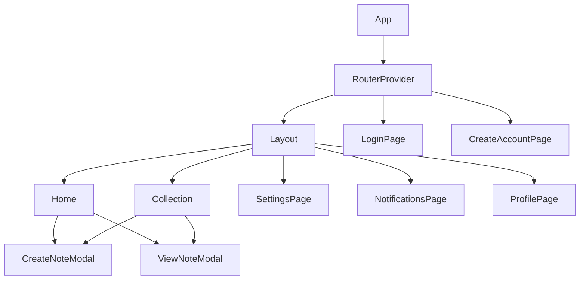
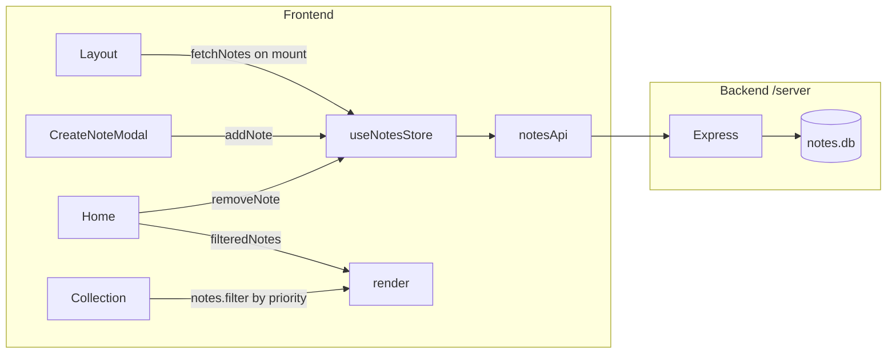
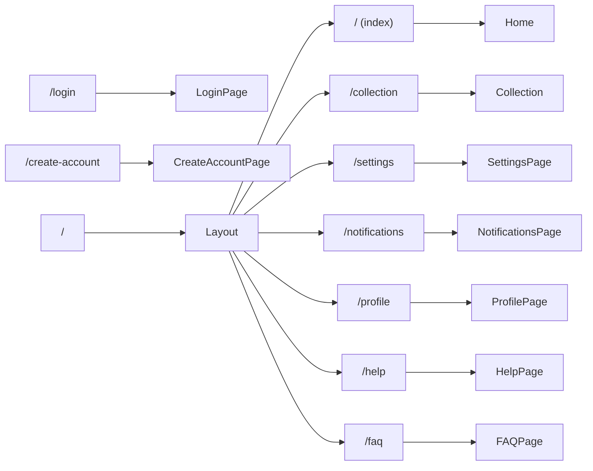
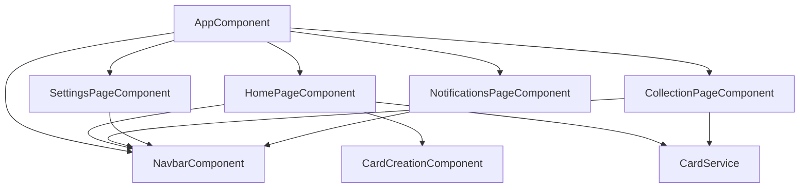
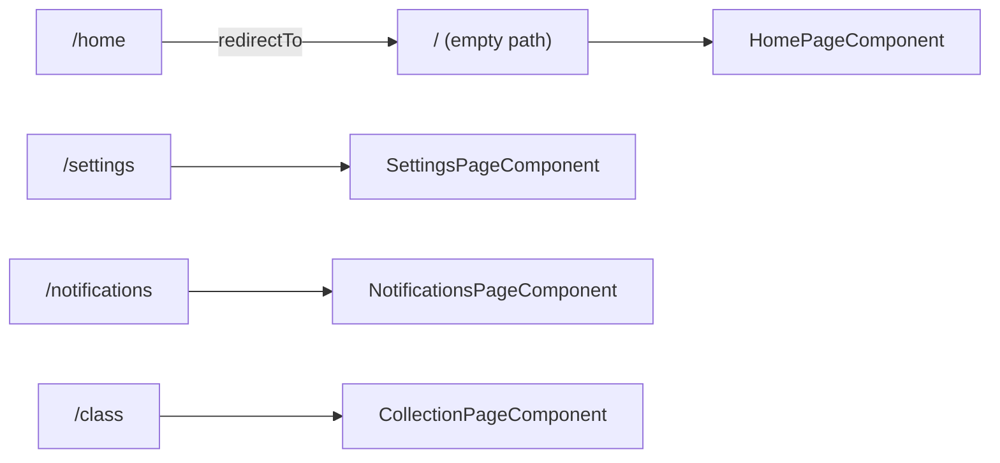

# MyOwnNotes — Copilot Instructions

These instructions are automatically applied to every Copilot interaction in this workspace.
Read them fully before taking any action.

---

## 1. Project Overview

**MyOwnNotes** is a personal note-taking web app built with React 18 + Vite.
Users create, categorize, view, and delete notes (called "cards").

**Tech Stack**
- React 18 — functional components + hooks (no class components)
- Material-UI (MUI) v7 — sole UI component library
- Zustand — global state management (`useNotesStore`)
- React Hook Form — form handling
- React Router v7 — client-side routing
- Vite 6 — build tool and dev server
- Tailwind CSS v4 — utility CSS (used sparingly alongside MUI)
- **Backend**: Node.js + Express 4 + `node:sqlite` (built-in) — REST API at `http://localhost:3001`

**Monorepo layout**
```
/ (root)           ← React + Vite frontend
  src/app/
    components/    ← shared UI components
    pages/         ← additional pages (Help, FAQ, etc.)
    services/      ← notesApi.ts (fetch wrapper)
    stores/        ← notesStore.ts (Zustand)
  server/          ← Express + SQLite backend
    routes/
      notes.js
    db.js
    index.js
```

**Dev commands**
- `npm run dev` — start Vite dev server (port 5173)
- `npm run server` — start Express API (port 3001)
- `npm run dev:full` — start both concurrently
- `npm run build` — production build

---

## 2. Architecture

### Component Tree



### Data Flow



### Routing



---

## 3. Folder & File Conventions

```
src/app/
  components/    ← reusable, non-routed components
    XxxComponent.tsx
  pages/         ← additional pages used in routes
    XxxPage.tsx
  services/
    notesApi.ts  ← fetch wrapper for /api/notes
  stores/
    notesStore.ts ← Zustand store
```

**Naming rules**
| Item | Convention | Example |
|---|---|---|
| Component file | `Xxx.tsx` (PascalCase) | `Home.tsx`, `CreateNoteModal.tsx` |
| Page file | `XxxPage.tsx` | `HelpPage.tsx` |
| Service file | `xxxApi.ts` | `notesApi.ts` |
| Store file | `xxxStore.ts` | `notesStore.ts` |

**Hard rules**
- Functional components ONLY — no class components
- MUI for all UI — no custom primitives, no raw HTML buttons/inputs without MUI wrapper
- All code in English — no other language in identifiers, comments, labels, or templates
- No `console.log` in production components

---

## 4. Core Patterns

### 4.1 State — Zustand Store

```typescript
// ✅ Correct: use useNotesStore hook in components
import { useNotesStore } from '../stores/notesStore';

function MyComponent() {
  const { notes, addNote, removeNote, fetchNotes } = useNotesStore();
  // ...
}
```

```typescript
// ✅ Store pattern
import { create } from 'zustand';

interface MyState {
  items: Item[];
  fetchItems: () => Promise<void>;
  addItem: (payload: ItemPayload) => Promise<void>;
  removeItem: (id: number) => Promise<void>;
}

export const useMyStore = create<MyState>((set, get) => ({
  items: [],
  fetchItems: async () => { /* call API, set state */ },
  addItem: async (payload) => { /* call API, update state */ },
  removeItem: async (id) => { /* call API, update state */ },
}));
```

### 4.2 API Service Pattern

```typescript
// src/app/services/xxxApi.ts
const API_BASE = 'http://localhost:3001/api/xxx';

export async function fetchItems(): Promise<Item[]> {
  const res = await fetch(API_BASE);
  if (!res.ok) throw new Error('Failed to fetch');
  return res.json();
}
```

### 4.3 Note Type

Always import `Note` from the store — never redefine it:

```typescript
import type { Note } from '../stores/notesStore';
// Note = { id, title, content, tag, priority, created_at, updated_at }
// priority: 'casual' | 'important' | 'crucial'
```

### 4.4 Priority Colors

```typescript
const priorityColors = {
  casual: '#2196F3',    // blue
  important: '#FF9800', // orange
  crucial: '#F44336',   // red
};
```

### 4.5 Loading Notes

Always call `fetchNotes()` in a `useEffect` — Layout already does this on mount, so individual pages do NOT need to re-fetch unless navigating directly.

### 4.6 Date Formatting

```typescript
function formatDate(isoString: string): string {
  const diff = Math.floor((Date.now() - new Date(isoString).getTime()) / 86400000);
  if (diff === 0) return 'Today';
  if (diff === 1) return 'Yesterday';
  return `${diff} days ago`;
}
```

---

## 5. Workflow Rules

### 5.1 Ultrathink Before Acting

Before writing any code:
1. Identify which existing files are relevant
2. Consider how the change fits into the current architecture
3. Identify side effects (other components that import the changed file, routes, stores)
4. Plan phases: what is sequential vs what can be parallel

### 5.2 Explore First (Subagent)

Always launch an `Explore` subagent to read relevant files before modifying anything.  
Never assume file contents — always verify.

### 5.3 Draw Before Implementing (Mermaid)

For any new feature, component, or service, produce a Mermaid diagram BEFORE writing code.

### 5.4 Build Verification

Always run `npm run build` after completing implementation and fix all errors before reporting done.
The chunk size warning is expected and can be ignored.

---

## 6. Backend Rules

- Express routes live in `server/routes/`
- Always validate input before writing to DB (`title` and `content` required; `priority` must be one of `casual | important | crucial`)
- Use parameterized queries — never string-concatenate user input into SQL
- `node:sqlite` is the built-in SQLite module (Node.js v22+); no native compilation needed
- The server runs on port `3001` (configurable via `PORT` env var)

---

## 7. What NOT To Do

- ❌ Never use Angular — this project has been fully migrated to React
- ❌ Never import from `express` in frontend component files
- ❌ Never hardcode mock data arrays in components — use `useNotesStore`
- ❌ Never use `console.log` for save/submit logic — connect to store
- ❌ Never create class components — functional + hooks only
- ❌ Never add features not explicitly asked for
- ❌ Never write Portuguese (or any non-English) in code, templates, comments, or labels
- ❌ Never concatenate user input directly into SQL strings (always use `?` parameters)


---

## 1. Project Overview

**MyOwnNotes** is a personal note-taking web app built with Angular 20.
Users create, categorize, view, and delete notes (called "cards").

**Tech Stack**
- Angular 20 — standalone components (no NgModules)
- Angular Material — sole UI library
- RxJS (`BehaviorSubject`) — in-memory state management
- Reactive Forms (`FormBuilder`) — all forms
- Angular SSR — Express server
- `ngx-autosize` — auto-resizing textareas
- Karma + Jasmine — unit testing

---

## 2. Architecture

### Component Tree



### Data Flow

```mermaid
flowchart LR
  subgraph CardService
    BS[BehaviorSubject&lt;Card[]&gt;]
  end

  HomePageComponent -- addCard / removeCard --> CardService
  CardService -- cardsSubject$ --> HomePageComponent
  CardService -- cardsSubject$ --> CollectionPageComponent

  CardCreationComponent -- cardContent EventEmitter --> HomePageComponent
  HomePageComponent -- opened / close Inputs --> CardCreationComponent
```

### Routing



---

## 3. Folder & File Conventions

```
src/app/
  pages/              ← routed page components
    xxx-page/
      xxx-page.component.ts
      xxx-page.component.html
      xxx-page.component.scss
      xxx-page.component.spec.ts   ← REQUIRED

  components/         ← shared, reusable components (not routed)
    xxx/
      xxx.ts
      xxx.html
      xxx.scss
      xxx.spec.ts                  ← REQUIRED

  shared/
    services/         ← injectable services
      xxx.service.ts
      xxx.service.spec.ts          ← REQUIRED
```

**Naming rules**
| Item | Convention | Example |
|---|---|---|
| Page class | `XxxPageComponent` | `HomePageComponent` |
| Shared component class | `XxxComponent` | `NavbarComponent`, `CardCreationComponent` |
| Service class | `XxxService` | `CardService` |
| Selector | `app-xxx` | `app-home-page`, `app-navbar` |
| File (pages) | `xxx-page.component.ts` | `home-page.component.ts` |
| File (components) | `xxx.ts` | `navbar.ts`, `card-creation.ts` |

**Hard rules**
- Standalone components ONLY — never use `NgModule`
- Angular Material ONLY for UI — no custom primitives, no third-party component libraries
- All code in English — no other language in identifiers, comments, labels, or templates

---

## 4. Core Patterns

### 4.1 State — BehaviorSubject Service

```typescript
// ✅ Correct pattern
@Injectable({ providedIn: 'root' })
export class XxxService {
  private xxxSubject = new BehaviorSubject<Xxx[]>([]);
  public xxxSubject$ = this.xxxSubject.asObservable(); // expose as Observable only

  addItem(item: Xxx): void {
    this.xxxSubject.next([...this.xxxSubject.value, item]);
  }

  removeItem(index: number): void {
    const updated = [...this.xxxSubject.value];
    updated.splice(index, 1);
    this.xxxSubject.next(updated);
  }

  getItems(): Xxx[] {
    return this.xxxSubject.value;
  }
}
```

### 4.2 Subscriptions — takeUntilDestroyed

```typescript
// ✅ Always use takeUntilDestroyed() in constructor — never ngOnDestroy + Subscription
constructor(private xxxService: XxxService) {
  this.xxxService.xxxSubject$
    .pipe(takeUntilDestroyed())
    .subscribe(items => { this.items = items; });
}
```

### 4.3 Reactive Forms

```typescript
constructor(private fb: FormBuilder) {
  this.form = this.fb.group({
    field: ['', Validators.required],
  });
}
```

```html
<!-- Always use mat-error for validation feedback -->
<mat-form-field appearance="outline">
  <mat-label>Label</mat-label>
  <input matInput formControlName="field" />
  <mat-error *ngIf="form.get('field')?.hasError('required')">Field is required</mat-error>
</mat-form-field>
```

### 4.4 Page Layout Template

Every page MUST follow this wrapper structure:

```html
<div class="layout">
  <app-navbar></app-navbar>
  <div class="content">
    <!-- page content here -->
  </div>
</div>
```

```scss
// Every page MUST have this base layout
.layout {
  display: flex;
  height: 100vh;
}
.content {
  flex: 1;
  padding: 32px;
  overflow-y: auto;
}
```

### 4.5 Component Communication

```typescript
// Child receives data via @Input, sends events via @Output
@Input() opened: boolean = false;
@Output() close = new EventEmitter<boolean>();
@Output() result = new EventEmitter<ResultType>();
```

### 4.6 Card Type

The canonical note type is defined in `CardService` — always import from there:

```typescript
import { Card } from '../../shared/services/card.service';
// type Card = { title: string; content: string; tag: string; cardTagType: string }
```

Card tag types are: `'casual'` | `'important'` | `'crucial'`

---

## 5. Workflow Rules

These rules are MANDATORY for every non-trivial task.

### 5.1 Ultrathink Before Acting

Before writing any code:
1. Identify which existing files are relevant
2. Consider how the change fits into the current architecture
3. Identify side effects (other components that import the changed file, routes, services)
4. Plan phases: what is sequential vs what can be parallel

### 5.2 Explore First (Subagent)

Always launch an `Explore` subagent to read relevant files before modifying anything.
Never assume file contents — always verify.

```
// Example: before adding a new feature to CollectionPage
→ Launch Explore subagent: "Read collection-page.component.ts, card.service.ts,
  and app.routes.ts in full. Return complete contents."
```

### 5.3 Draw Before Implementing (Mermaid)

For any new feature, component, or service, produce a Mermaid diagram BEFORE writing code.

Required diagrams per task type:
- **New page**: component tree diagram + routing update diagram
- **New service**: data flow diagram (who produces, who consumes)
- **New component**: parent↔child communication diagram (inputs/outputs)
- **Refactor**: before/after architecture diagram

Present the diagram to the user and confirm before proceeding to implementation.

### 5.4 Phase Planning

Always label work as sequential or parallel before starting:

```
Phase 1 (sequential — must complete first):
  - Fix X because Y depends on it

Phase 2 (parallel — all can run simultaneously):
  - Task A (independent)
  - Task B (independent)
  - Task C (independent)

Phase 3 (sequential — needs Phase 2 output):
  - Wire routes
  - Run build verification
```

### 5.5 Parallel Subagents

For multiple independent tasks (e.g. building 3 new pages), launch one subagent per task simultaneously using `runSubagent`, not sequentially.

### 5.6 Build Verification

Always run `npx ng build` after completing implementation and fix all errors before reporting done.
The budget warning (`bundle exceeded maximum budget`) is expected and can be ignored.

---

## 6. Test Rules

**All tests are mandatory. Never skip.**

### Spec file pattern (standalone components)

```typescript
import { ComponentFixture, TestBed } from '@angular/core/testing';
import { XxxPageComponent } from './xxx-page.component';

describe('XxxPageComponent', () => {
  let component: XxxPageComponent;
  let fixture: ComponentFixture<XxxPageComponent>;

  beforeEach(async () => {
    await TestBed.configureTestingModule({
      imports: [XxxPageComponent],   // standalone: import the component directly
    }).compileComponents();

    fixture = TestBed.createComponent(XxxPageComponent);
    component = fixture.componentInstance;
    fixture.detectChanges();
  });

  it('should create', () => {
    expect(component).toBeTruthy();
  });
});
```

### Spec file pattern (services)

```typescript
import { TestBed } from '@angular/core/testing';
import { XxxService } from './xxx.service';

describe('XxxService', () => {
  let service: XxxService;

  beforeEach(() => {
    TestBed.configureTestingModule({});
    service = TestBed.inject(XxxService);
  });

  it('should be created', () => {
    expect(service).toBeTruthy();
  });
});
```

### Rules
- Co-locate `.spec.ts` next to the file it tests — same folder, same base name
- Minimum: one `should create` / `should be created` test per file
- If a service has `addItem`/`removeItem`/`getItems` methods, test each
- If a component has public methods, test their state changes

---

## 7. What NOT To Do

- ❌ Never import from `express` in Angular component or service files
- ❌ Never use `ngOnDestroy + Subscription` for cleanup — use `takeUntilDestroyed()`
- ❌ Never call `.subscribe()` on a Subject directly to push values — use `.next()`
- ❌ Never create `NgModule` — standalone only
- ❌ Never add features not explicitly asked for
- ❌ Never write Portuguese (or any non-English) in code, templates, comments, or labels
- ❌ Never duplicate `RouterModule` or `MatIconModule` in the same `imports` array
